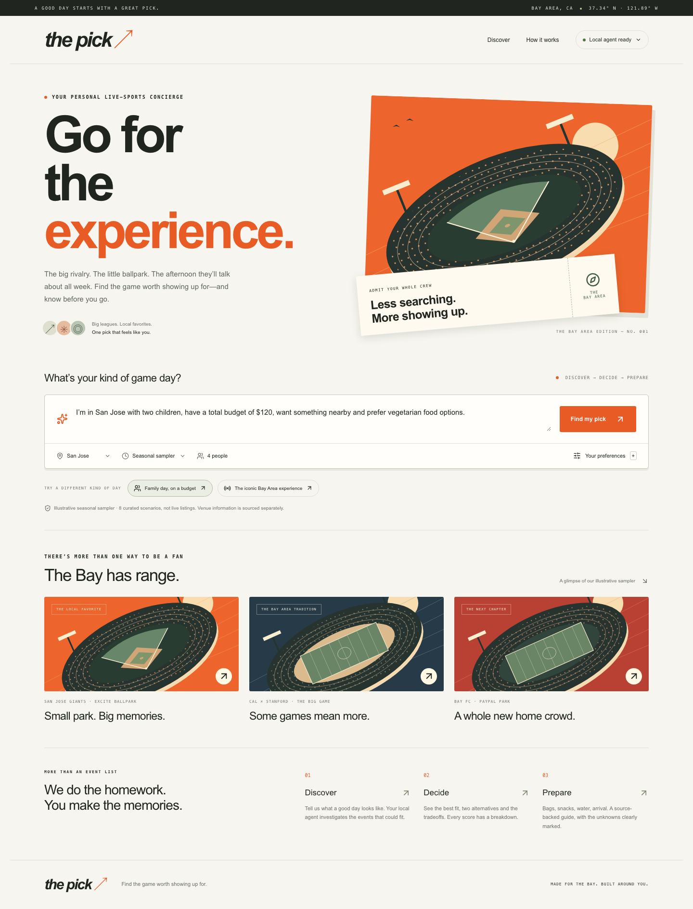
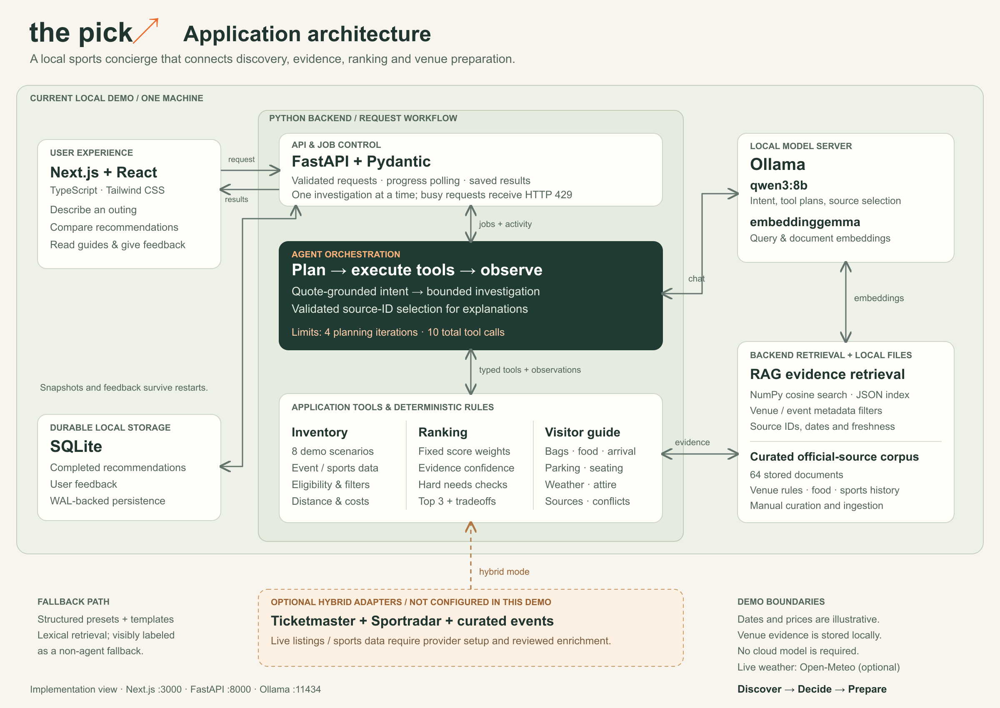

# The Pick — Team 10 ↗

**Find the game worth showing up for—and know before you go.**

A local, Ollama-powered Bay Area sports concierge for families, travelers, newcomers and first-time attendees. Discover → Decide → Prepare: describe a day out, see one prominent recommendation and two smaller alternatives, then prepare with inline venue guidance and a detailed source-backed guide.

This is a runnable class-project prototype, not a live ticket service. Its eight **illustrative seasonal scenarios** compare major professional games with selected local and college experiences. Dates, opponents, ticket prices, outing allowances and editorial score inputs are authored assumptions. The 64-document venue/history corpus contains independently sourced, concise official-page summaries. It does not imply those fixtures actually exist.



## Architecture



[Open the full-size diagram](docs/diagrams/the-pick-architecture.png) · [Architecture details](docs/ARCHITECTURE.md) · [Editable SVG](docs/diagrams/the-pick-architecture.svg)

## Run locally

Prerequisites: Python **3.12**, [uv](https://docs.astral.sh/uv/), Node.js **24 LTS**, and [Ollama](https://ollama.com/). No OpenAI API, cloud model or external sports API key is used in the demo.

```bash
cp .env.example .env
ollama serve  # separate terminal; skip if already running
ollama pull qwen3:8b
ollama pull embeddinggemma

cd backend
uv sync --frozen
uv run python -m scripts.ingest
uv run python -m scripts.preflight
cd ../frontend
npm ci
cd ..
./scripts/dev.sh
```

Open **http://localhost:3000**. The backend is at **http://localhost:8000**, with interactive API docs at **http://localhost:8000/docs**. The header should say **Local agent ready** before presenting. `scripts/dev.sh` also recognizes the project-local Node runtime installed during development, if it exists.

Run separately if preferred:

```bash
# terminal 1, backend/
uv run uvicorn app.main:app --host 127.0.0.1 --port 8000
# terminal 2, frontend/
npm run dev
```

A missing model or missing semantic index triggers a visible non-agent fallback. Run ingestion after changing the corpus or embedding model. Model weights, indices, local requests and feedback are excluded from version control.

## The demonstration

1. Choose **Family day, on a budget** and select **Find my pick**. The agent extracts the party, budget and needs; the deterministic engine can favor San Jose Giants over the more expensive major games.
2. Inspect score breakdowns and the ordinary distance-sorted baseline. Open **Know before you go**. The guide exposes conflicting official clutch dimensions and does **not** invent vegetarian availability.
3. Choose **The iconic Bay Area experience**, then search again. Without budget or distance constraints, the Big Game/49ers/MLB experiences can lead. The model chooses different evidence tools; the weights and algorithm are unchanged.

The sampler spans September and November; it is not a single real weekend. A real date filter still works and can correctly produce no results. See the [four-minute competition script](docs/COMPETITION_SCRIPT.md).

## Why this is an agent

Ollama first extracts field changes, each grounded in an exact quote from the request. Pydantic validates the result; edited form fields override extraction. A bounded plan/execute/observe loop then asks Ollama to select typed evidence tools, inspects observations and allows follow-up calls. The default is at most four planning iterations and ten total tool executions, including deterministic stages. Tool plans and public activity are retained; private reasoning is never requested or displayed.

The agent is implemented as a transparent Python orchestration layer, without a heavy agent framework. Tool decisions are schema-constrained JSON commands over Ollama `/api/chat`. They are dispatched through a typed registry; this is a custom tool protocol, not a provider-specific native `tool_calls` envelope.

The model cannot edit scores. Grounded explanations are deliberately **extractive**: Ollama selects source IDs from the evidence associated with each ranked event; Python renders those exact claims alongside deterministic fit statements. Unknown or cross-event citations fail validation.

**Event APIs = What is happening?**  
**Sports APIs = What is happening competitively?**  
**RAG = Why does it matter, and what should the visitor know?**  
**Agent = Which evidence should be gathered?**  
**Scoring engine = Which option best fits the user?**  
**Ollama = How should the request be understood and the grounded result explained?**

## Scoring and evidence

Base weights: user fit 25%, cultural/competitive significance 20%, atmosphere 15%, convenience 15%, value 15%, personal needs 10%. Eligibility and hard constraints run first. Missing or irrelevant factors get **no score**; available weights are divided by their sum. There is no local-event bonus and no hard-coded winning event. Ties use confidence, event time, then ID.

A total outing estimate is `minimum ticket price × all attendees + explicit outing allowance`. The sampler allowance covers modeled fees, food and transport; it is not a verified real-world estimate. Children count as ticketed attendees unless a future provider supplies validated age-specific prices. Missing prices or allowances cannot pass a hard total budget. Distance is Haversine straight-line miles, not travel time. “Nearby” defaults to 25 miles. Unsupported locations must supply coordinates through the API or choose a supported city/ZIP.

**Evidence Confidence is separate.** It combines source quality, relevant-category coverage and available factors; stale sources, absent prices and unverified dietary needs lower it. Illustrative events are capped at 75%. This is an interpretable prototype heuristic, not calibrated statistical probability. See [architecture and formulas](docs/ARCHITECTURE.md).

The vector index stores cosine-searchable embeddings with the embedding-model name and a corpus fingerprint. Ingestion and retrieval use the same model. Exact venue/event metadata filters prevent a similar-sounding venue’s policies from contaminating a guide. Stored operational summaries become stale after 90 days. Retrieval dates are visible and never renewed merely by rerunning a recommendation.

Policy precedence: event-specific official → team/event-type official → official venue → older/general fallback. Older policy is labeled rather than silently overriding current guidance. Conflicts are displayed with both citations. Food menus never imply allergy safety or guaranteed event-day availability.

## Modes and providers

| Mode | Model / retrieval | Inventory | Honest UI label |
|---|---|---|---|
| `APP_MODE=demo` | Ollama + embeddinggemma | Illustrative event/sports fixtures | Local agent + illustrative data |
| `APP_MODE=hybrid` | Ollama + embeddinggemma | Ticketmaster + verified curated feed; optional Sportradar | Hybrid; per-event live/curated badges |
| `APP_MODE=fallback` or UI fallback | Presets/form + lexical retrieval + template | Demo fixtures | “Fallback mode—agent reasoning is unavailable.” |

Only demo agent or hybrid mode is a successful agent presentation. Fallback does not interpret free text. If extraction fails, the application explicitly reports that the preset/form was used. If later investigation fails, already validated intent/evidence can be retained, with a fallback warning.

Ticketmaster normalizes dates, coordinates, USD prices and public sources; it rejects cancellations, malformed records and unresolved start times. It does **not** invent a compelling attendance signal from a listing. Hybrid candidates need reviewed signal enrichment or a verified curated entry to pass the gate. `backend/data/local_events/events.json` is intentionally empty until verified real fixtures are supplied: the demo fixtures must not leak into hybrid mode. See [curation](docs/CURATION.md).

Sportradar has a conservative licensed-schedule adapter, requiring both a key and the exact product feed path. It matches teams and start times. It does not infer standings or player stats from a schedule response. These adapters have normalization/failure tests; **credentialed live-provider integration has not been run**.

## API

| Endpoint | Purpose |
|---|---|
| `GET /health` | Service and preflight readiness |
| `GET /api/providers` | Model installation, index and provider status |
| `POST /api/recommendations` | Complete synchronous investigation |
| `GET /api/recommendations/{request_id}` | Retrieve a stored response |
| `POST /api/jobs` | Start a browser investigation |
| `GET /api/jobs/{request_id}` | Poll actual completed activity and result |
| `POST /api/feedback` | Store thumbs, attendance intent, reason and correction |
| `GET /api/demo/fixtures/{event_id}` | Inspect labeled authored assumptions |

```bash
curl http://localhost:8000/api/recommendations \
  -H 'Content-Type: application/json' \
  -d '{"query":"I am in San Jose with two children and a total budget of $120. I want something nearby and prefer vegetarian options.","mode":"agent"}'
```

Local SQLite persists complete responses and feedback, with versioned DDL and parameterized queries. Feedback never automatically changes scoring weights. One inference runs at a time; a busy service returns 429. The app has bounded requests, restricted CORS, safe errors and no external actions or purchases.

## Verify

```bash
cd backend
uv run ruff check app tests scripts
uv run pytest -q
uv run python -m scripts.evaluate
# Optional real integration; start the backend first:
uv run python -m scripts.demo_check

cd ../frontend
npm test
npm run typecheck
npm run build
# With frontend and backend running:
npx playwright install chromium
npm run test:e2e
```

The production script uses supported Webpack because a Turbopack worker hit an OS port-binding error in the development environment. Dependencies are pinned by `uv.lock` and `package-lock.json`.

See [evaluation results](docs/EVALUATION.md), [troubleshooting](docs/TROUBLESHOOTING.md), and [deployment notes](docs/DEPLOYMENT.md). Docker configuration is included as an alternative; local native Ollama is the presentation path.

## Scope and limits

This is a curated comparison prototype, not comprehensive Bay Area coverage. Real-time schedules, ticket inventory, all-in live prices, driving times and comprehensive concession menus are not provided in demo mode. Editorial significance/atmosphere/family ratings are visible scenario assumptions. Some venues have sparse evidence, which lowers confidence. A checked source can still contain outdated guidance; always recheck event-specific instructions. Strict dietary/accessibility requirements exclude events when supporting evidence is absent.

No human preference study has been conducted, so the evaluation baseline shows illustrative differences in ordering, not proof of better recommendations. There is no authentication, buying, betting, tracking, scraping pipeline or automated weight learning. Public internet hosting needs additional access controls and operational hardening. Rename the product with `APP_NAME` for the backend and `NEXT_PUBLIC_APP_NAME` for the frontend (`frontend/lib/brand.ts`); rebuild the frontend after changing public environment variables.


## Recommendation-led interface

The winner also previews parking, seating convenience and clothing tips. **Parking & comfort** opens sourced venue details, review dates, and clearly labeled comfort suggestions; live prices, parking spaces and seat inventory remain unverified. Weather within the available forecast window now informs clothing suggestions, with official clothing and umbrella rules displayed alongside them.

The cream-and-orange design uses dark green for the featured pick and guide actions. A desktop preferences sidebar collapses on mobile. Requests still use the real local agent, and changing preferences labels the old results until the next search. The introduction becomes compact once an investigation starts. The distance-sort comparison is retained in evaluation data instead of the main page.

- [Updated silent demo video](docs/demo-video-v4/the-pick-demo.mp4)
- [Redesign notes and verification](docs/UI_REDESIGN.md)
- [Family result screenshot](docs/screenshots/redesign/family-desktop.png)
- [Iconic result screenshot](docs/screenshots/redesign/iconic-desktop.png)

### Weather setup

`WEATHER_PROVIDER=open_meteo` is the default and needs no API key for this non-commercial prototype. Set it to `disabled` for fully offline operation. Forecasts are fetched server-side for the top three venue/start-time combinations, cached for 30 minutes, and bounded by a six-second total timeout. Provider failure leaves recommendations usable with a clearly labeled fallback. Forecasts beyond the supported window (up to 16 days) and past events never substitute today's weather.

The [Open-Meteo free tier](https://open-meteo.com/en/pricing) supports evaluation/prototyping; commercial use requires the appropriate service plan. No weather credentials are added to the frontend or repository.

### Silent demo walkthrough

The latest demo is `docs/demo-video-v4/the-pick-demo.mp4`: a 3–4 minute silent walkthrough with on-screen chapter captions. It shows both family-on-a-budget and iconic searches, with the full venue guide shown once for the family outing: bags, food, parking, seating, weather and attire. A separate timed voiceover script is included for adding narration later. Recording/export instructions are in `docs/demo-video-v4/README.md`; prior videos remain available.

## Preparing an upload

Keep real credentials in your local `.env`. Only `.env.example`, with blank API-key values, belongs in the repository. Local databases, model runtimes, dependencies, build output and recording intermediates are excluded by `.gitignore`.

Run `python3 scripts/prepare-upload.py` to check the upload file set for known local credentials and common secret patterns, then create `dist/Team-10-Project.zip`. The archive includes source code, dependency lockfiles, documentation, architecture images and finished demo videos. It excludes Git history and ignored local files. The check reports filenames and line numbers without printing matched values; it does not upload anything.
