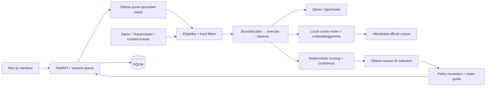

# Architecture

## Repository boundaries

- `models/domain.py`: Pydantic contracts, constrained input, safe source URLs, timezone-aware event dates.
- `agents/intent.py`: schema-constrained field changes with literal supporting quotes. Defaults never imply a winning event. Known nearby requests receive a documented 25-mile interpretation. The model cannot invent coordinates.
- `agents/tools.py`: typed tool inputs/outputs, ten named tools, total execution counter, timeout/error envelopes and citation metadata.
- `agents/orchestrator.py`: plan/execute/observe loop, deterministic checks, top-three assembly and progress notifications.
- `providers/`: interchangeable event, sports, LLM, embedding and distance providers.
- `rag/index.py`: chunking, allowlisted sources, model+corpus fingerprint, atomic JSON vector persistence, cosine search, metadata gates, retrieval-score and citation propagation.
- `ranking/engine.py`: eligibility, hard filters, needs evidence, distance, costs, scoring and stable ordering.
- `services/policies.py`: field-level official-source resolution, conflicts, stale/missing warnings and food records.
- `core/database.py`: versioned SQLite schema and isolated repository interface.
- `main.py`: restricted HTTP API, local one-at-a-time inference queue, safe errors and persistence.

## Score formulas

Let `b = [.25, .20, .15, .15, .15, .10]` and `A` be factors with supported and relevant inputs. For each available factor, `w_i = b_i / sum(b_j for j in A)`; unavailable factors have zero weight and a null value. Opportunity Score is `round(sum(w_i * factor_i), 1)`.

- User fit: mean of applicable explicit sport/team matches, desired atmosphere, iconic significance or rivalry signal, and family rating. Unsupported components are omitted.
- Significance and experience: reviewed source-backed rubric values. The demo supplies labeled assumptions; live listings without supporting rubric data leave these missing.
- Convenience: `max(0, 100 * (1 - straight_line_miles / radius))`. No radius preference makes this irrelevant.
- Value: percentage of budget remaining after the chosen price basis. A free event with a zero budget receives 100. No budget preference makes this irrelevant.
- Personal needs: mean of supported family/dietary/accessibility inputs; if any requested need is unknown, the aggregate remains unavailable. Strict dietary/accessibility needs instead fail the hard evidence gate.

Evidence Confidence uses `100 * (.45 * mean_source_quality + .35 * relevant_category_coverage + .20 * available_base_weight)`, with stale source quality multiplied by .45; unverified requested dietary needs subtract 15, unknown modeled cost subtracts 8, and illustrative records are capped at 75. Scores are clamped to 0–100. It is a presentation-friendly heuristic, not a probability.

A different inventory label cannot change an event’s score. Tie breaking is Opportunity Score descending, confidence descending, time ascending and ID ascending. Ranking can change if the agent retrieves different evidence. The deterministic guarantee applies to identical intent, candidates and evidence—not all model runs.

## Agent and grounding

The model selects tools and arguments using a JSON Schema over `/api/chat`; the application executes them. It sees bounded observations, never secrets. Four planning iterations and ten total tool calls are defaults. Six stage calls are reserved for parsing, search, qualification, distance, ranking and guides. It can spend the remaining four on evidence checks, including retries with a focused query.

For compatibility with Ollama’s grammar compiler, numeric/string length bounds are omitted only from the wire schema. Every property remains typed; the full original Pydantic model validates the returned object, including all bounds. Model inference uses temperature zero, a bounded context/output and limited retries. Grounded explanations select existing source IDs, then use exact supplied claims; no free-form model policy/price prose enters the response.

Retrieved text is serialized as data. There is no shell tool, arbitrary URL-fetch tool or retrieved-instruction execution. Invalid event IDs and source IDs are rejected. Context and operational facts are limited to the candidate venue and applicable event type. An embedding-model mismatch invalidates the semantic index instead of mixing vectors.

## Persistence and deployment

SQLite uses WAL, parameter binding and foreign keys. API response snapshots make previous requests reviewable. Feedback validates the selected event against its stored recommendation. Schema changes increment `PRAGMA user_version`; a future PostgreSQL repository can replace the isolated SQL adapter. SQLite feedback is local and unencrypted; no accounts or multi-user isolation are claimed.

The vector store is an intentionally small NumPy cosine index persisted atomically as JSON. At 64 short chunks it is simpler and more inspectable than a vector service. For thousands of documents, replace the same retrieval boundary with Chroma or pgvector.

Health distinguishes a running service from an agent-ready service. Startup checks do not download models automatically. Manual ingestion is deliberate and reproducible. Request progress is held in bounded process memory; completed results are durable. A backend restart loses in-flight jobs but not completed recommendations.

### Practical visitor preparation

The bounded `generate_event_guide` stage performs an exact venue, sport and optional event-ID lookup for parking and seating summaries after ranking. These facts join each recommendation’s citations without changing its score or competing with policy/context retrieval limits. The guide generator independently enforces the same scope for food, arrival, parking and seating. Sources retain review dates and freshness; explicitly outdated-season summaries remain stale even after a recent review.

`EventGuide.parking` and `seating` contain evidence objects. `attire_tips` and `seating_tip` contain clearly labeled editorial suggestions. All additions have defaults for stored-response compatibility. The winning card previews the three topics and opens the new Parking & comfort tab directly; every alternative has the same full-guide capability.

### Event-time weather

Within `generate_event_guide`, a server-side Open-Meteo adapter fetches forecasts concurrently for the top three results. UTC hourly matching handles local evening windows that cross midnight. Weather is enrichment after ranking; it does not verify an illustrative fixture or alter scores. The adapter validates units, coverage and finite numeric values, retains unknown precipitation as null, caches successful data for 30 minutes (failures for one minute), bounds cache size, and limits total request time to six seconds.

`EventGuide.weather` carries explicit availability, retrieval time, planning-window timestamps and summarized Fahrenheit/mph values. `attire_rules` carries official evidence; `attire_tips` combines deterministic weather-based comfort suggestions with reminders about those rules. No clothing permission is inferred from missing evidence. The existing guide and recommendations remain usable when weather is disabled, unavailable, or outside the forecast horizon.
